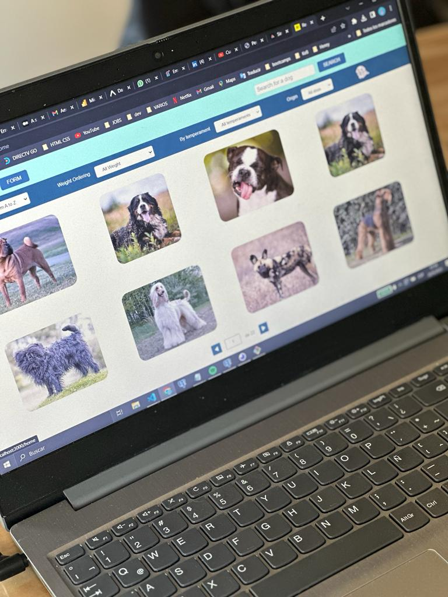
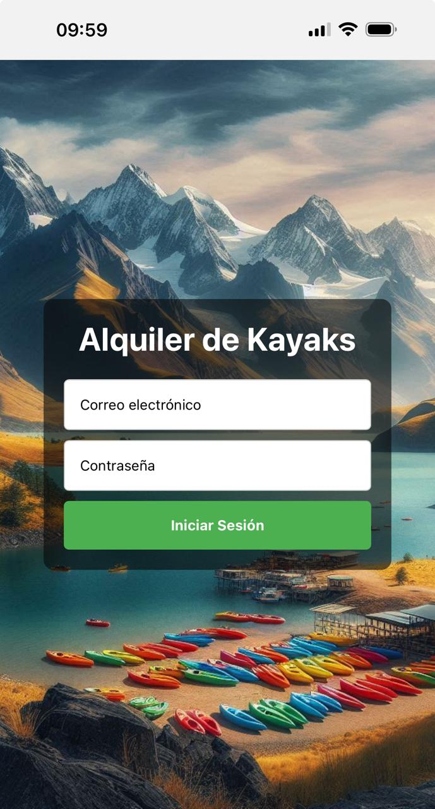

# Personal Portfolio Website

## About Me

Hi, I'm **Carolina Quintoman**, a Full Stack Developer from Argentina. With two years of programming experience, I have developed a strong passion for coding and teamwork. I have contributed to the Code Community, mastering Python and Django, and I am proficient in JavaScript, Node.js, React, SQL, and Postgres. I am always eager to learn and take on new challenges and projects.

## Skills

- Web Development
- Web App Development
- Python and Django
- JavaScript, Node.js, React
- SQL and Postgres

## Experience

- **2021-2023**: Web App Development - Dog - Code Community
- **2024**: Web App Outfits - CONCET - Frontend
- **2024**: Web App Barber Shop - Next.js, Nastify, Zustand, MongoDB - Frontend and Backend
- **2024**: Mobile App - Rental Kayaks

## Education

- **2022**: Bootcamp - Digital House
- **2023**: Development Bootcamp - HENRY

## Projects

### Code Community

Design and develop a Social Network App for programmers that included: searches, combined filtering, ordering, posting, communities, validations, bans, books section, premium payments. Group project, Back End and then Front End.

### Woof World

Design and develop a dog App that included: searches, combined filtering, ordering, creation and details of each dog. Individual project, Front End and Back End, Consume API.

### Rental Kayaks

Simple Mobile App Design. Kayak Rentals, complete a form, Administrator Dashboard, and view daily earnings. Firebase, Zustand, React Native with Expo.

## Contact Me

- **Email**: quintoman.carolina@gmail.com
- **Phone**: +54 9 2944 816965
- **LinkedIn**: [Carolina Quintoman](https://www.linkedin.com/in/carolina-quintoman-037452148/)

## Download CV

[Download CV](images/Carolina%20Quintoman%20-%20CV.pdf)

## License

This project is licensed under the MIT License - see the [LICENSE](LICENSE) file for details.

---

Thank you for visiting my profile! I am always open to new opportunities and exciting projects.